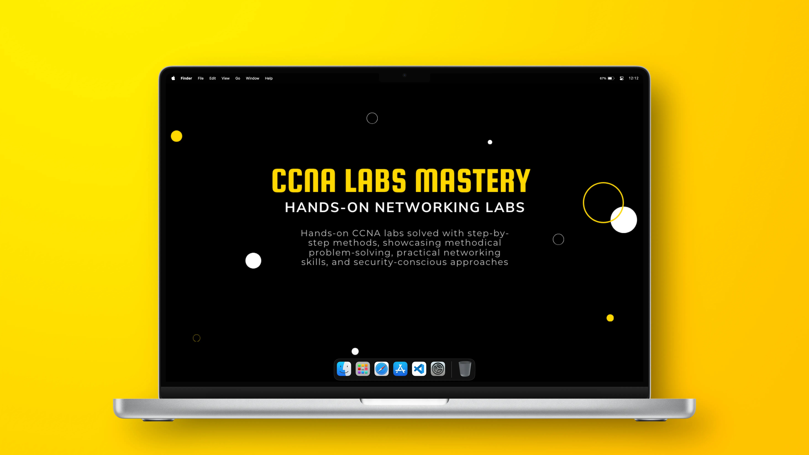

# CCNA Labs Mastery

A professional collection of hands-on networking labs, documenting **step-by-step solutions, configurations, and verifications** as part of my **CCNA certification journey**.  
This project demonstrates my practical networking skills, troubleshooting abilities, and professional documentation practices.

 

  

 

---

## Project Overview

**CCNA Labs Mastery** is designed to replicate real-world networking scenarios.  
It includes:

- Hands-on lab exercises for CCNA topics
- Step-by-step configuration and troubleshooting
- Screenshot and topology documentation
- Downloadable lab files for replication
- **Tools & Platforms:** Cisco Packet Tracer, EVE-NG, Wireshark, GNS3

This repo reflects **industry-standard networking practices** and is intended as a **demonstration of my CCNA skills**.

 

---

## Lab Dashboard

| Lab #                     | Lab Name & Topic | Description                                             | Link                               |
| ------------------------- | ---------------- | ------------------------------------------------------- | ---------------------------------- |
| [1](labs/lab-1/README.md) | CLI Introduction | Introduction of Cisco CLI and some basic configurations | [View Lab 1](labs/lab-1/README.md) |

 

---

## Features

- **Comprehensive Lab Coverage** — spans all CCNA topics from beginner to advanced, ensuring mastery of core networking concepts
- **Step-by-Step Documentation** — includes clear instructions, annotated screenshots, and configuration files for reproducibility
- **Hands-On Verification** — real-world testing with outputs and results demonstrating successful configurations
- **Downloadable Lab Files** — labs are ready to run in Packet Tracer or EVE-NG for practical practice
- **Interactive Lab Dashboard** — quickly navigate to any lab’s full documentation directly from the dashboard

 

---

## License

This project is licensed under the **Creative Commons Attribution-NonCommercial-NoDerivatives 4.0 International License**.

You are free to:

- **Share** — copy and redistribute the material in any medium or format.

Under the following terms:

- **Attribution** — give appropriate credit, provide a link to the license, and indicate if changes were made.
- **NonCommercial** — do not use the material for commercial purposes.
- **NoDerivatives** — do not remix, transform, or build upon the material.

Full License: [LICENSE](LICENSE)

 

---

 
 

Click for more details About Me, This Project & The Knowledge Applied

## About Me, This Project & The Knowledge Applied

This project is part of my **CCNA Certification portfolio** — designed to demonstrate **real-world networking expertise** and professional documentation skills.

By completing all labs with **step-by-step solutions, verification outputs, and topology diagrams**, I have created a **comprehensive hands-on networking portfolio**.  
The project covers competencies across all CCNA 200-301 domains:

---

<strong>1. Network Fundamentals</strong>

- Understanding OSI & TCP/IP models
- IP addressing, subnetting, and VLSM
- Network topology design and documentation
- Cabling standards and connectivity verification

---

<strong>2. Network Access (Switching & VLANs)</strong>

- Configuring VLANs and trunking
- Inter-VLAN routing
- Switch security features and port configurations
- Troubleshooting VLAN connectivity
- Wireless basics (SSID, authentication, basic config)

---

<strong>3. IP Connectivity (Routing & WAN)</strong>

- Static routing and default routes
- RIP, OSPF, and EIGRP configuration
- Routing table verification and troubleshooting
- WAN interface testing (PPP, Frame Relay)
- Network convergence and path verification

---

<strong>4. IP Services</strong>

- DHCP and IP assignment verification
- NAT and PAT configuration
- NTP, SNMP, and Syslog basics
- QoS overview and traffic management
- DNS resolution in labs

---

<strong>5. Security Fundamentals</strong>

- Access Control Lists (standard & extended)
- Port security on switches
- Basic VPN and secure remote access concepts
- Threat simulation and mitigation exercises

---

<strong>6. Automation & Programmability</strong>

- Understanding REST APIs and controller-based networking
- Device management automation concepts
- Configuration management using scripts or tools
- Basic network programmability awareness

---

<strong>7. Troubleshooting & Verification</strong>

- Ping, traceroute, and loopback tests
- Packet capture analysis (Wireshark)
- Log monitoring and verification commands
- Structured troubleshooting methodology across all domains

## 

 
 

Click for Contact Links

**Connect with me:**

- [GitHub](https://github.com/MustafaHabibX)

 
 

 
  <a href="#lab-dashboard">Lab Dashboard</a> • 
  <a href="https://github.com/MustafaHabibX">GitHub</a> • 
  <a href="/LICENSE">License</a>

