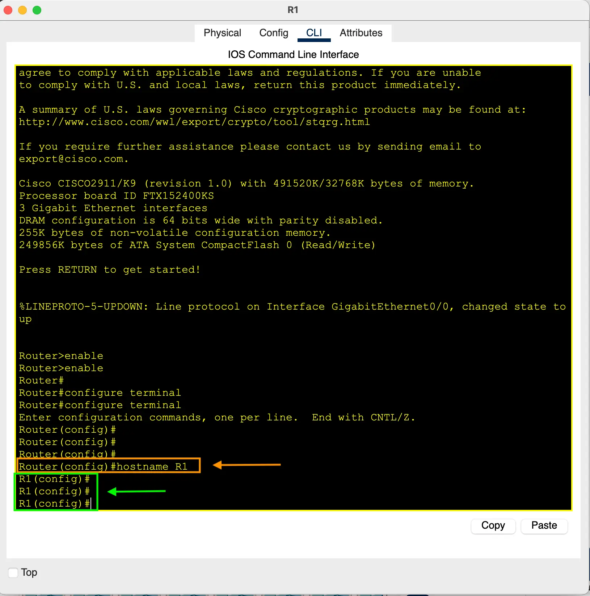

<p align="center">
   No Previous • 
  <a href="/README.md"> Dashboard</a> • 
  <a href="/labs/lab-2/README.md"> Next (Lab 2)</a>
</p>

<br>

# Lab 1 – Introduction to CLI and Basic Configurations

## Learning Objectives

By completing this lab, you will be able to:

- Navigate Cisco IOS CLI modes
- Configure device hostnames
- Secure Privileged EXEC mode with both unencrypted and encrypted passwords
- Apply password encryption to configuration files
- Differentiate between `enable password` and `enable secret`
- Save running configurations to startup configurations

<br>

## Table of Contents

- [Tasks for this Lab](#tasks-for-this-lab)
- [Network Topology](#network-topology)
- [Task 1: Configure Hostnames](#task-1-configure-hostnames)
- [Task 2: Configure an Unencrypted Enable Password](#task-2-configure-an-unencrypted-enable-password)
- [Task 3: Test the Enable Password](#task-3-test-the-enable-password)
- [Task 4: View the Password in Running Configuration](#task-4-view-the-password-in-running-configuration)
- [Task 5: Enable Password Encryption](#task-5-enable-password-encryption)
- [Task 6: Verify Encrypted Passwords](#task-6-verify-encrypted-passwords)
- [Task 7: Configure Enable Secret](#task-7-configure-enable-secret)
- [Task 8: Verify Enable Secret Priority](#task-8-verify-enable-secret-priority)
- [Task 9: Compare Encryption Types](#task-9-compare-encryption-types)
- [Task 10: Save Configuration](#task-10-save-configuration)
- [Summary](#summary)

<br>

## Tasks for this Lab

1. Change the hostnames of the router and switch (`R1`, `SW1`).
2. Configure an unencrypted enable password (`CCNA`) on both devices.
3. Exit to User EXEC mode and test the password.
4. View the password in the running configuration.
5. Ensure all current and future passwords are encrypted.
6. View the encrypted password in the running configuration.
7. Configure a more secure enable secret (`Cisco`) on both devices.
8. Exit and re-enter Privileged EXEC mode. Which password is required?
9. Compare the encryption types for `enable password` vs `enable secret`.
10. Save the running configuration to startup configuration.

<br>

## Network Topology

  <p align="center">
    
  </p>

<br>

---

## Task 1: Configure Hostnames

By default, Cisco devices use their device type as the hostname (`Router>`, `Switch>`).  
Changing hostnames makes CLI sessions clearer, especially in multi-device topologies.

**Steps:**

```plaintext
Router> enable
Router# configure terminal
Router(config)# hostname R1
R1(config)#
```

**Result:** The prompt changes to `R1>`.  
Repeat on the switch to set hostname `SW1`.

### Screenshots

- R1 hostname configuration
  <p align="center">
    
  </p>
- SW1 hostname configuration
  <p align="center">
    
  </p>

---

## Task 2: Configure an Unencrypted Enable Password

The **enable password** secures Privileged EXEC mode. Without it, anyone can enter with just `enable`.

**Steps:**

```plaintext
R1(config)# enable password CCNA
```

Now, to enter Privileged EXEC mode:

```plaintext
R1> enable
Password: CCNA
R1#
```

### Screenshots

- R1 configuration
  <p align="center">
    
  </p>
- SW1 configuration
  <p align="center">
    
  </p>

---

## Task 3: Test the Enable Password

Exit to User EXEC mode and re-enter. The password will be requested.

- Correct password → access granted.
- Wrong password (3 attempts) → error: `Bad secrets`.

### Screenshots

- Device prompting for enable password
  <p align="center">
    
  </p>
- Successful login with correct password
  <p align="center">
    
  </p>
- Failed login attempt
  <p align="center">
    
  </p>

<br>

---

## Task 4: View the Password in Running Configuration

The enable password is stored in plaintext until encrypted.

**Steps:**

```plaintext
SW1# show running-config
```

### Screenshot

  <p align="center">
    
  </p>

<br>

---

## Task 5: Enable Password Encryption

To prevent plaintext storage, use Cisco’s weak **Type 7 encryption** (`service password-encryption`).

**Steps:**

```plaintext
SW1(config)# service password-encryption
```

### Screenshot

  <p align="center">
    
  </p>

<br>

---

## Task 6: Verify Encrypted Passwords

Re-check the running configuration. The enable password is now encrypted.

**Steps:**

```plaintext
SW1# show running-config
```

- Notice: It shows as `7 <encrypted-string>` → Type 7 encryption.

### Screenshot

  <p align="center">
    
  </p>

<br>

---

## Task 7: Configure Enable Secret

The **enable secret** uses stronger **Type 5 (MD5 hash)** encryption.  
It overrides the enable password if both are configured.

**Steps:**

```plaintext
SW1(config)# enable secret myPassword
```

### Screenshot

  <p align="center">
    
  </p>

<br>

---

## Task 8: Verify Enable Secret Priority

If both are set, only the **enable secret** is used.

- Entering `enable password CCNA` → denied.
- Entering `enable secret myPassword` → access granted.

### Screenshot

  <p align="center">
    
  </p>

<br>

---

## Task 9: Compare Encryption Types

View both in the configuration file.

- `enable password` → Type 7 (weak encryption)
- `enable secret` → Type 5 (MD5, stronger)

### Screenshot

  <p align="center">
    
  </p>

<br>

---

## Task 10: Save Configuration

The running configuration is temporary. Save it to startup configuration for persistence.

**Options:**

```plaintext
SW1# write
SW1# write memory
SW1# copy running-config startup-config
```

### Screenshot

  <p align="center">
    
  </p>

<br>

---

## Summary

In this lab, we:

- Navigated Cisco IOS CLI modes.
- Configured hostnames for clarity.
- Secured Privileged EXEC mode with both unencrypted and encrypted passwords.
- Learned the difference between `enable password` (Type 7, weak) and `enable secret` (Type 5, stronger).
- Applied `service password-encryption` to protect configuration files.
- Saved configurations to ensure persistence after reboot.

These foundational skills are essential for all future labs and real-world Cisco device management.

---

<br>
<br>
<br>

<p align="center">
   No Previous • 
  <a href="/README.md"> Dashboard</a> • 
  <a href="/labs/lab-2/README.md"> Next (Lab 2)</a>
</p>
