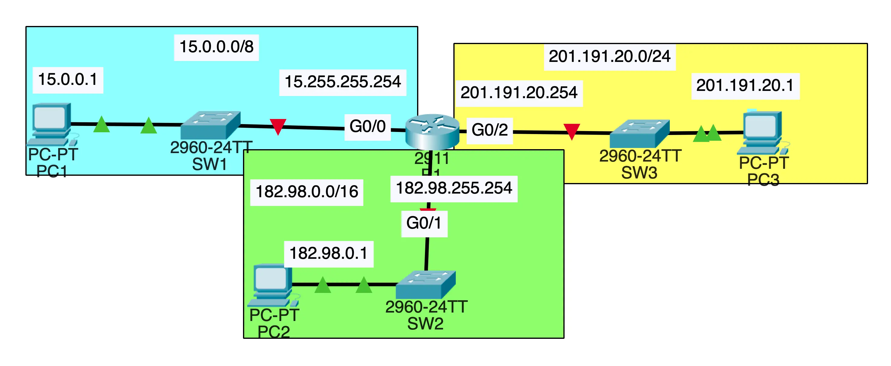
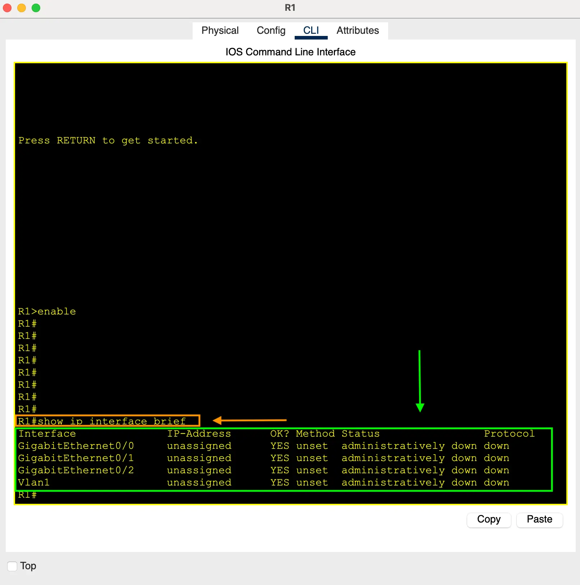

<p align="center">
  <a href="/labs/lab-2/README.md">Previous (Lab 2)</a> • 
  <a href="/README.md">Dashboard</a> • 
  <a href="/labs/lab-4/README.md">Next (Lab 4)</a>
</p>

<br>

# Lab 3 – IPv4 Configurations

## Learning Objectives

By completing this lab, you will be able to:

- Configure IPv4 addresses on routers and end devices
- Verify interface and connectivity status using Cisco IOS commands
- Confirm configuration changes using the running configuration
- Test and verify IPv4 network connectivity using ping

<br>

## Table of Contents

- [Tasks for this Lab](#tasks-for-this-lab)
- [Network Topology](#network-topology)
- [Task 1: Configure R1's Hostname](#task-1-configure-r1s-hostname)
- [Task 2: Verify R1 Interface Status](#task-2-verify-r1-interface-status)
- [Task 3: Configure R1 Interfaces](#task-3-configure-r1-interfaces)
- [Task 4: Verify R1 Interfaces](#task-4-verify-r1-interfaces)
- [Task 5: View Running Configuration to Verify Interface IPs](#task-5-view-running-configuration-to-verify-interface-ips)
- [Task 6: Configure PC IPv4 Settings](#task-6-configure-pc-ipv4-settings)
- [Task 7: Test Connectivity](#task-7-test-connectivity)
- [Device Configurations](#device-configurations)
- [Summary](#summary)

<br>

## Tasks for this Lab

1. Configure R1's hostname
2. Use a `show` command to view R1's interface information
3. Configure the appropriate IP addresses, enable the interfaces, and add descriptions
4. Verify R1's interface status
5. View the running configuration to confirm interface IP assignments
6. Configure IPv4 settings for PC1, PC2, and PC3
7. Test end-to-end connectivity using ping

<br>

## Network Topology

<p align="center">
  
</p>

<br>

---

## Task 1: Configure R1's Hostname

```plaintext
Router(config)# hostname R1
```

### Screenshot

<p align="center">
  
</p>

<br>

---

## Task 2: Verify R1 Interface Status

```plaintext
R1# show ip interface brief
```

### Screenshot

<p align="center">
  
</p>

<br>

---

## Task 3: Configure R1 Interfaces

We will assign the IP addresses as shown in the topology diagram.

### IP Address Plan for R1

| Interface | IP Address     | Subnet Mask   | Description |
| --------- | -------------- | ------------- | ----------- |
| G0/0      | 15.255.255.254 | 255.0.0.0     | To SW1      |
| G0/1      | 182.98.255.254 | 255.255.0.0   | To SW2      |
| G0/2      | 201.191.20.254 | 255.255.255.0 | To SW3      |

<p align="center">
  
</p>

### Configure Interface G0/0

```plaintext
R1(config)# interface g0/0
R1(config-if)# ip address 15.255.255.254 255.0.0.0
R1(config-if)# description ## to SW1 ##
R1(config-if)# no shutdown
```

<p align="center">
  
</p>

<p align="center">
  
</p>

### Configure Interface G0/1

```plaintext
R1(config)# interface g0/1
R1(config-if)# ip address 182.98.255.254 255.255.0.0
R1(config-if)# description ## to SW2 ##
R1(config-if)# no shutdown
```

<p align="center">
  
</p>

<p align="center">
  
</p>

### Configure Interface G0/2

```plaintext
R1(config)# interface g0/2
R1(config-if)# ip address 201.191.20.254 255.255.255.0
R1(config-if)# description ## to SW3 ##
R1(config-if)# no shutdown
```

<p align="center">
  
</p>

<p align="center">
  
</p>

<br>

---

## Task 4: Verify R1 Interfaces

```plaintext
R1# show ip interface brief
```

### Screenshot

<p align="center">
  
</p>

<br>

---

## Task 5: View Running Configuration to Verify Interface IPs

Using the `show running-config` command to confirm that the IP addresses assigned to R1's interfaces match your intended configuration.

```plaintext
R1# show running-config
```

### Screenshot

<p align="center">
  
</p>

<br>

---

## Task 6: Configure PC IPv4 Settings

### Steps to Configure

1. Click on a Virtual PC (e.g., PC1).
2. Open the **Config** tab.
   <p align="center">
     
   </p>
3. Under the **GLOBAL** section, click **Settings** and set the Default Gateway.
   <p align="center">
     
   </p>
4. Under the **INTERFACE** section, click **FastEthernet0** and configure the IP address and subnet mask.
   <p align="center">
     
   </p>

<br>

### IP Address Plan

| Device | IPv4 Address | Subnet Mask   | Default Gateway |
| ------ | ------------ | ------------- | --------------- |
| PC1    | 15.0.0.1     | 255.0.0.0     | 15.255.255.254  |
| PC2    | 182.98.0.1   | 255.255.0.0   | 182.98.255.254  |
| PC3    | 201.191.20.1 | 255.255.255.0 | 201.191.20.254  |

### PC1 Configuration

<p align="center">
  
</p>
<p align="center">
  
</p>

### PC2 Configuration

<p align="center">
  
</p>
<p align="center">
  
</p>

### PC3 Configuration

<p align="center">
  
</p>
<p align="center">
  
</p>

<br>

---

## Task 7: Test Connectivity

### Steps

1. Open **PC1**.
2. Navigate to the **Desktop** tab.
   <p align="center">
     
   </p>
3. Open the **Command Prompt**.
   <p align="center">
     
   </p>
4. Ping the IP addresses of PC2 from PC1.

```plaintext
C:\> ping 182.98.0.1
```

<p align="center">
  
</p>

<br>

---

## Device Configurations

- [R1](configs/R1.txt)
- [PC1 Config](configs/PC1.txt)
- [PC2 Config](configs/PC2.txt)
- [PC3 Config](configs/PC3.txt)

<br>

---

## Summary

In this lab, you:

- Configured IPv4 addresses on a router and PCs
- Verified interface status using IOS commands
- Checked interface IP assignments via the running configuration
- Successfully tested end-to-end connectivity across three networks

---

<br>
<br>
<br>

<p align="center">
  <a href="/labs/lab-2/README.md">Previous (Lab 2)</a> • 
  <a href="/README.md">Dashboard</a> • 
  <a href="/labs/lab-4/README.md">Next (Lab 4)</a>
</p>
